# Hola, mi nombre es Jhonatan Alvarez 👋
### Ingeniero de software | Mobile Developer | FrontEnd Developer

Soy ingeniero de software profesional desde 2023.

Ingeniero de Software con mas de 3 años de experiencia en el desarrollo de aplicaciones móviles usando Flutter, amplio conocimiento en gestores de estado como BloC, Provider y riverpod, manejo de base de datos en dispositivo relacionales (SQlite) y no relacionales(Isar), experiencia en integraciones con funcionalidades nativas Android e Ios, despliegue en plataformas de distribución de aplicaciones como PlayStore y AppStore(abiertas, cerradas, beta, producción) y conocimientos en arquitectura de software, particularmente en Clean Architecture. Líder técnico para equipos de desarrollo, destacado por habilidades en revisión de código (CodeReview) y aseguramiento la calidad y la adherencia a las mejores prácticas en el desarrollo y conocimientos en adroid nativo con el lenguaje de Kotlin.

Frontend Web: Desarrollo de aplicaciones escalables con React y Next.js, optimización del rendimiento y SEO, y dominio de herramientas modernas de desarrollo web.

## Tecnologías y Principios

| **Flutter**  | **Dart**  | **SOLID**  |
|:-------------------------------------------------------------------------------------------------:|:---------------------------------------------------------------------------------------------:|:-------------------------------------------------------------------------------------------------------:|
| **Clean Architecture**  | **Django**  | **Django Rest Framework**  |
| **Python**  | **React**  | **Next.js**  |
| **HTML5**  | **CSS3**  | **JavaScript**  |
| **GitHub**  | **GitLab**  | **Scrum**  |
| **Jira**  |  |  |

# Algunos proyectos personales

# MoviesBook
#### Descripción
MoviesBook es la aplicación perfecta para los amantes del cine que buscan simplicidad y velocidad. Con MoviesBook, no necesitas registrarte ni iniciar sesión para acceder a un vasto catálogo de películas. Descubre qué películas están en cartelera, cuáles son las más populares y mejor calificadas, y guarda tus favoritas en un apartado especial para verlas en el futuro.
MoviesBook es la app ideal para cinéfilos que valoran el acceso inmediato y sin complicaciones al mundo del cine. ¡Descarga ahora y disfruta de tu próxima película en solo unos clics!
#### Características
- Sin registro ni inicio de sesión: Accede a toda la información de películas al instante, sin barreras.
- Diversidad de categorías: Encuentra películas en cines, populares y las mejor calificadas, con actualizaciones constantes.
- Favoritos sin conexión: Guarda tus películas favoritas en una lista especial y accede a ella en cualquier momento.
#### Implementación
API Rest de TheMovieDB: La app aprovecha los datos detallados y actualizados de TheMovieDB, ofreciendo información completa de cada película.
Gestión de estado con Riverpod: MoviesBook utiliza Riverpod para una experiencia fluida y rápida en la navegación, incluso con múltiples categorías.
Base de datos en el dispositivo con iSAr: Gracias a iSAr, una base de datos no relacional, tus favoritos se guardan de forma segura en tu dispositivo, garantizando una experiencia sin interrupciones incluso sin conexión.
#### Capturas de pantalla

  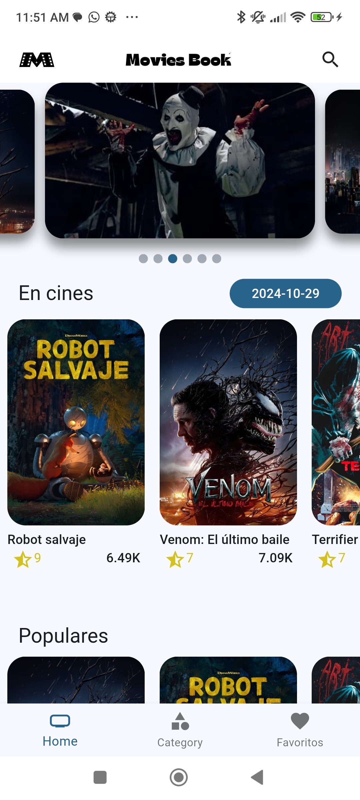
  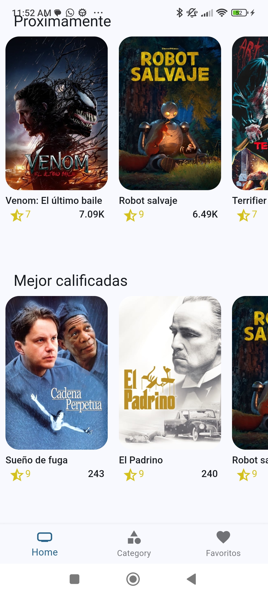
  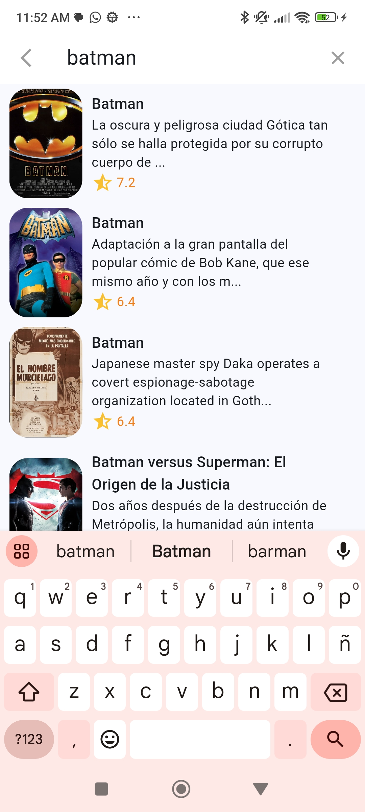
  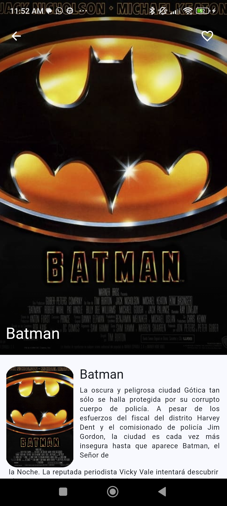

  
  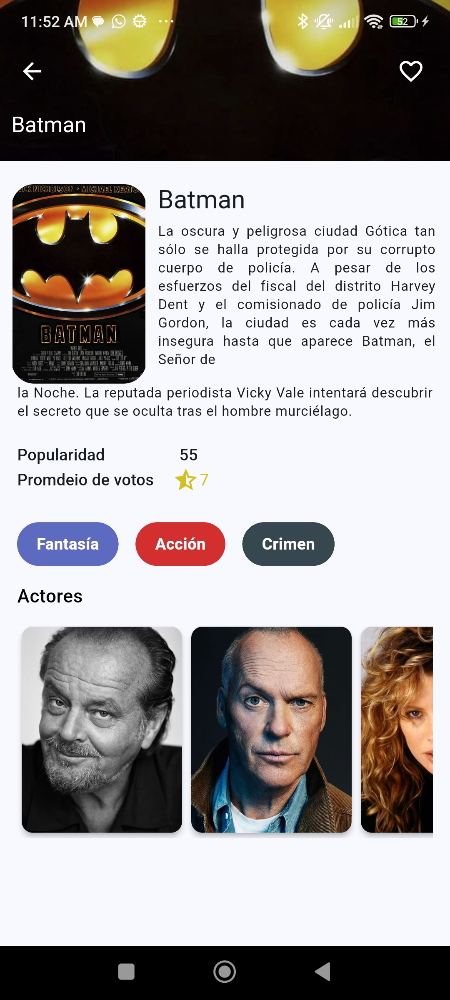
  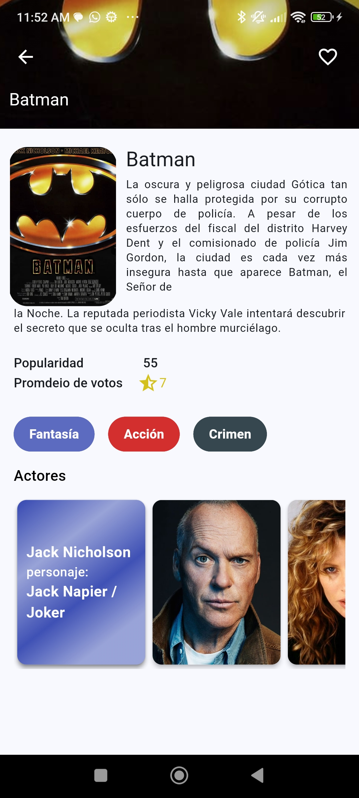
  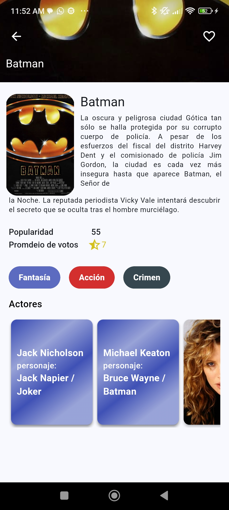
  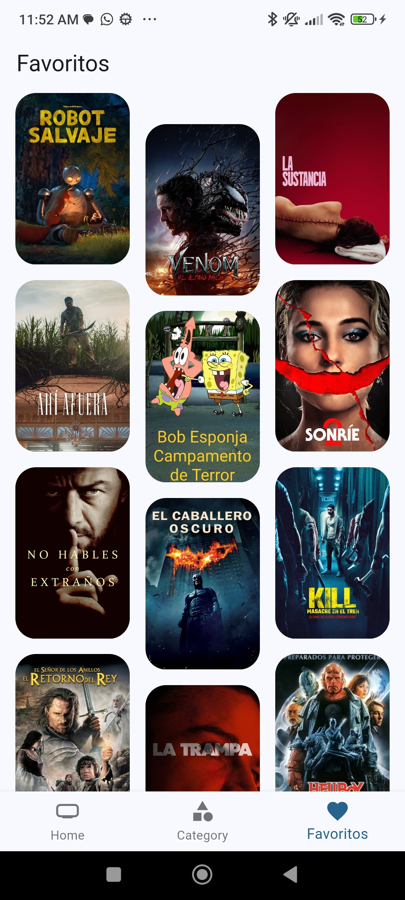

*Inicio, Buscar, Detalles, Favorito*
[MoviesBook - GitHub Repository](https://github.com/JhonatanAlvarezDhoz/TredingMovieApp/tree/dev)

# SlideVideoApp

#### Descripción

SlideVideoApp es una aplicación diseñada para visualizar videos orientados verticalmente. La app permite  ofrece controles básicos, como reproducir y pausar, esta ofreceuna experiencia de visualización  inspirada en ticktok. Está destinada exclusivamente para la visualización de videos proporcionados en los assets en tiempo de ejecución.

#### Características

- Controles simples para pausar y reproducir videos.
- Interfaz de usuario fluida, optimizada para pantallas móviles.

#### Capturas de pantalla

  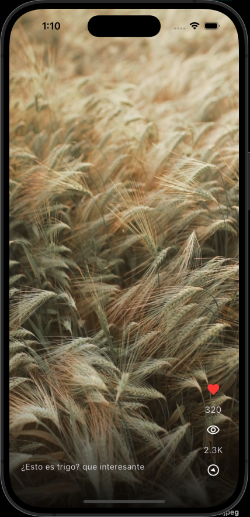
  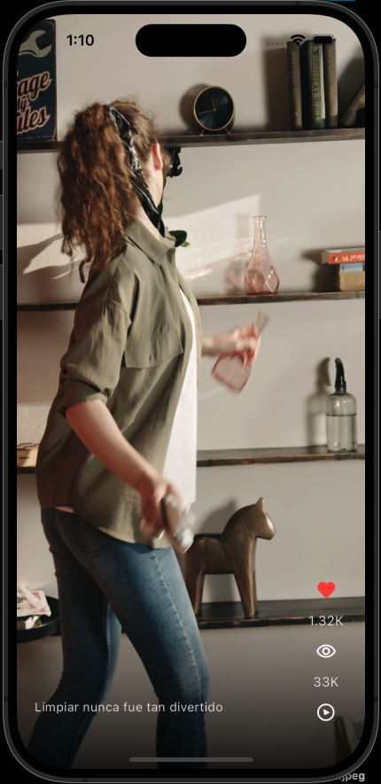
  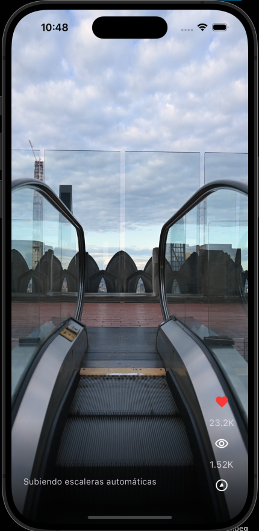

*Pantalla de reproductor de video*

[SlideVideoApp - GitHub Repository](https://github.com/JhonatanAlvarezDhoz/SlideVideoApp/tree/dev)

